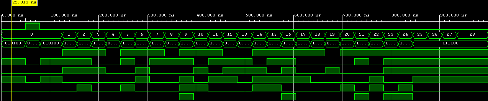

### Team members

* Samuel Gubi (responsible for ...)
* Jan Těžký (responsible for ...)
* Maroš Fandel (responsible for ...)

## Theoretical description and explanation

Morseovu abecedu pro všechna písmena (26) jsme si rozepsali podle tabulky viz. Abeceda.xlsx (pokud nezapomenu, ještě ji vložím jako tabulku sem - možná v ní ještě něco přibyde)

## Hardware description of demo application

Insert descriptive text and schematic(s) of your implementation.

## Software description

Put flowchats/state diagrams of your algorithm(s) and direct links to source/testbench files in `src` and `sim` folders. 

### Component(s) simulation

1. abc_to_morse
    Simulovali jsme písmena znázorněné v bin kódu ('a'-'z' => 0-25, zbytek (26-31) je jako 'z'). Testbench se jmenuje v projektu tb_abc_to_morse.
    Screenshot: 

## Instructions

Write an instruction manual for your application, including photos or a link to a video.

## References

1. https://codegolf.stackexchange.com/questions/173837/longest-seven-segment-word
2. https://en.wikipedia.org/wiki/Morse_code
3. 
