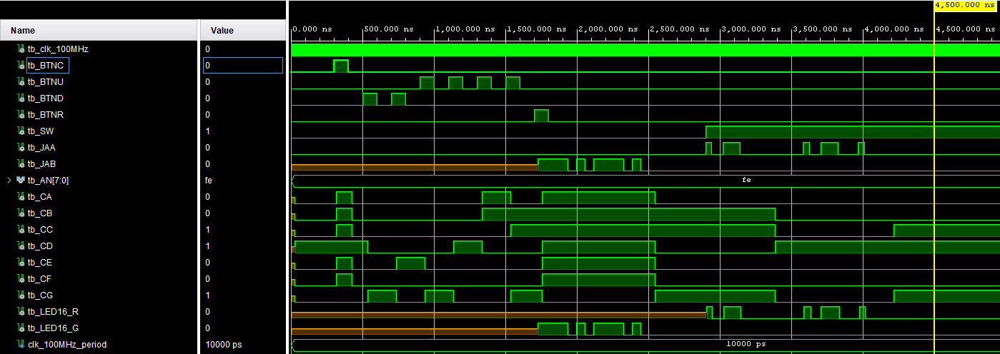
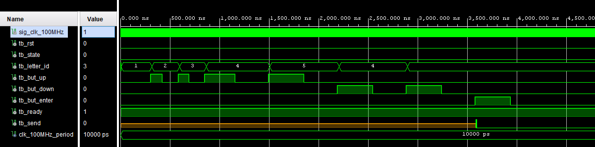

# Project Morse 

- [Team members](#team-members)
- [Theoretical description and explanation](#theoretical-description-and-explanation)
- [Hardware description of demo application](#hardware-description-of-demo-application)
- [Software description](#software-description)
  - [Implemented elements](#implemented-elements)
    - [Debounce mechanics](#debounce-mechanics)
    - [Custom library](#custom-library)
    - [Detection logic](#detection-logic)
  - [Component(s) simulation](#components-simulation)
    - [Top](#top)
    - [Abc_7seg_out](#abc_7seg_out)
    - [Morse_deliver](#morse_deliver)
    - [Morse_detect](#morse_detect)
- [Instructions](#instructions)
- [References](#references)

### Team members

* Samuel Gubi (responsible for ...)
* Jan Těžký (responsible for all)
* Maroš Fandel (responsible for ...)

## Theoretical description and explanation

Our idea was to create a 2in1 device that would recognize and send Morse code.
We are able to recognize letters (indices 1-26) and numbers (indices 27-36). Index 0 is reserved for errors.

The transmitter/receiver is selected using a switch.

Transmitter:
Letter selection is handled via a 7-segment display and two buttons that select the symbol up and down. The selected letter is sent using another button and a morse code is generated on the output (and LED), with the '-' lit during sending.

Receiver:
Receives the signal from the input and recognizes the letter according to the appropriate pulse length. Once recognized, it displays it on the 7-segment display. If not recognized, '-' is displayed.

## Hardware description of demo application

There is a switch (first from the right) to select between transmitter and receiver.
Synchronous reset is applied by pressing the middle of the 5 buttons.

Transmitter (SW = '0'):
Use the 3 buttons (up, down, enter - right) to select and send a letter. In this state, the 7-segment display shows the selected letter, which we can send at any time. After sending, the JA[1] pin serves as output. In case of sending we see the output on the diode in green.

Receiver (SW = '1')
Receive the signal on pin JA[0]. In this state, the 7-segment display shows the recognized letter until the next one is recognized. In case of a recognition error, display '-'. In case of reception we see the input on the diode in red.

## Software description

### Implemented elements

#### Debounce mechanics

This mechanism ensures that the button is only pressed once. Once pressed, a local counter is activated, which counts up to the size defined in the constant debounce_threshold. Only then will the code be executed.

This eliminates transient phenomena such as repeated pressing, unintended double presses, and so on.

#### Custom library

With this component, we define our own functions and types, which are stored in a library and called by a name of our choice. In our case, we use it to convert an index and a symbol to a 7-segment code.

Unfortunately, I couldn't use the library everywhere, even though I had previously defined it, because I ran into a problem with the size of a string (array) and had to define it using a case statement. However, that's the first thing I would change in future versions of the program.

#### Detection logic

This code defines four cases, or states, that the program can be in. The first state, **IDLE**, is waiting for a '1' input signal. Once this is received, the program resets the *current length* and transitions to the **SIGNAL_ON** state.

In the **SIGNAL_ON** state, the program waits for a '0' input signal to determine whether the signal represents a dot or a comma in Morse code. The length of the signal is tracked using the *current_length* variable. If the signal is a dot and the Morse code letter is not yet complete, the program adds a '0' to the current_letter array and transitions to the **INTER_LETTER** state. If the signal is a comma and the Morse code letter is not yet complete, the program adds a '1' to the current_letter array and transitions to the **INTER_LETTER** state. If the Morse code letter is already complete, the program transitions back to the **IDLE** state.

In the **SIGNAL_OFF** state, the program waits for a '0' input signal to determine whether the Morse code letter is complete or not. If the signal is a '1', the program transitions back to the **SIGNAL_ON** state. If the signal is a '0' and the time interval is less than *dot_t*, the program waits for another signal to continue the current letter. If the time interval is greater than *dot_t*, the program transitions to the **INTER_LETTER** state.

In the **INTER_LETTER state**, the program waits for a '1' input signal to determine the end of the current Morse code letter. Once this is received, the program resets the current length and transitions back to the **SIGNAL_ON** state. If the end of the letter is not detected within the *comma_t* time interval, the program transitions back to the **SIGNAL_OFF** state.

### Component(s) simulation

#### Top

We tested how the top structure (with all active structures) behaves. 
When the button is turned off, it behaves like a transmitter and starts displaying the letters to send. We then ran a reset for a few moments to display '-'.
We then tested 2x button down (and going from index 1 to 36) and 4x button up (and going from index 36 to 1). Everything is displayed according to the map (see references).
Pressing enter sent the signal (. - . -) as expected and the display lit up again when the send was complete.
We then (approx. 2,8 us) switched to the receiver using the switch. Both signals were successfully detected (.- as A and .-. as R) and shown on the display.

#### Abc_7seg_out

We tested entering (with debounce drive on 0) 4x up, 2x down and 1x enter buttons. The result is that the tb_letter_id parameter changes as expected and a pulse is sent when enter is pressed.

#### Morse_deliver

We tested sending the appropriate signal after activating tb_enter_pulse. We sent the first number 0 (error) to the tb_letter_id variable, which is sent as 5 dots (this condition cannot occur, but its interpretation can be changed in the code - index 0 can never be selected through abc_7seg_out).
Both the letter A (1) and P (16) were sent correctly. Likewise, the ready signal was only displayed when the send was complete.

#### Morse_detect

We tested (with modified thresholds for the period and comma) the Morse code of the letters A, C, G and U. All were recognized correctly. The index is -2147483648 at the start (base variable size integer), this state is then constrained by conditions. At first glance, the letters may appear offset, but we must remember that the program waits for the end of the input before outputting the letter index.

## Instructions

To select the receiver/transmitter, toggle the switch (lower position for transmitter, upper position for receiver).

In transmitter mode, use the up and down buttons to select a character. Once you have selected a letter, send it using the right (enter) key. To abort the send operation, press the middle button (reset) at any time. During sending, the display shows '-' and you cannot select and send letters.

In receiver mode you do nothing but wait for the signal to be received and then you can see the converted signal on the display.

## References

Map for 7-segment display:

1. https://codegolf.stackexchange.com/questions/173837/longest-seven-segment-word
2. https://en.wikipedia.org/wiki/Morse_code